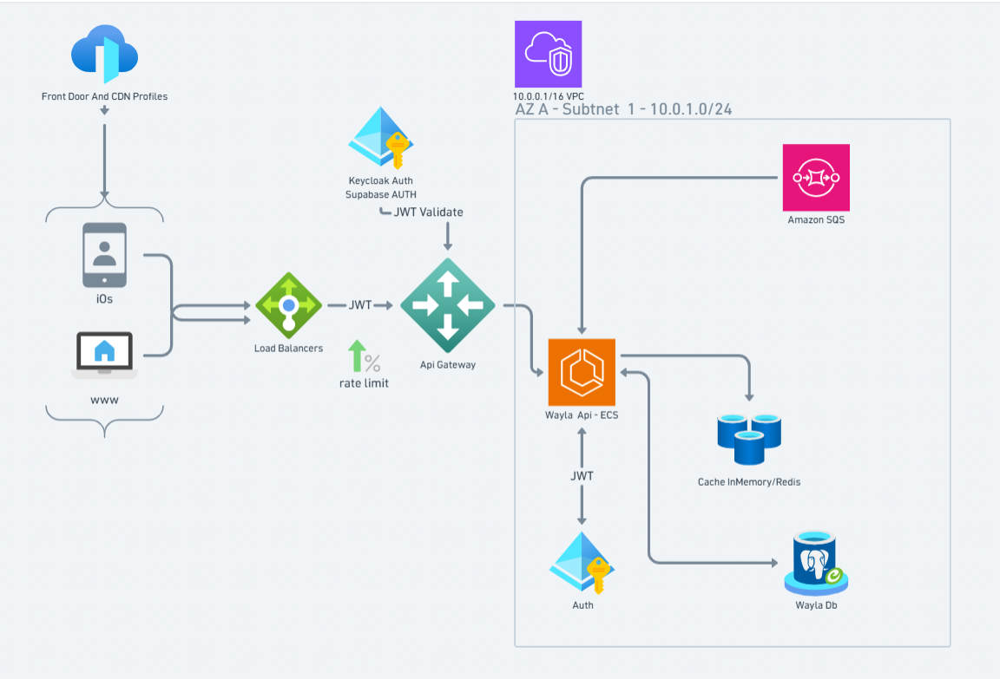

# What is Wayla?

Wayla is an AI travel companion that helps people plan trips, discover places, and get personalized recommendations — not just static lists from generic travel sites.

## High-Level Design (HLD)

This document describes the Wayla platform architecture: how clients reach the API, how traffic is secured and routed, and how services inside the VPC communicate.

## Architecture diagram



---

## Overview

Wayla uses a **multi-tier, cloud-native** design that combines:

| Layer | Role |
|-------|------|
| **Edge / CDN** | Global entry, caching, edge protection |
| **Traffic & API gateway** | Load balancing, rate limiting, routing |
| **Authentication** | JWT validation (external IdPs + internal auth) |
| **Application (VPC)** | Core API on ECS, messaging, cache, database |

Clients (iOS and web) send HTTPS requests through AWS Front Door/CDN and AWS load balancers. The API Gateway validates JWTs and applies rate limits before forwarding traffic into a private VPC where **Wayla Api** runs on ECS.

---

## Components

### 1. Entry & clients

| Component | Description |
|-----------|-------------|
| **Front Door & CDN Profiles** | AWS Front Door (or equivalent CDN). Terminates TLS at the edge, caches static assets, and routes traffic to the origin. |
| **iOS** | Native mobile clients. |
| **www** | Web browser clients. |

**Communication:** CDN → clients (delivery); clients → Load Balancers (API requests).

---

### 2. Traffic management & API gateway

| Component | Description |
|-----------|-------------|
| **Load Balancers** | AWS Application/Network Load Balancer. Distributes incoming traffic across healthy targets and provides a stable public endpoint. |
| **API Gateway** | AWS API Gateway. Single controlled entry into backend services; handles routing, throttling integration, and optional request/response transforms. |

**Communication:**

| From | To | Protocol / payload | Purpose |
|------|-----|-------------------|---------|
| Clients | Load Balancers | HTTPS | User API calls |
| Load Balancers | API Gateway | HTTPS (often with **JWT** in `Authorization` header) | Forward authenticated traffic |
| API Gateway | Wayla Api (ECS) | HTTPS / HTTP (private) | Invoke backend after validation |

**Annotations on the diagram:**

- **JWT** — Clients present a Bearer token on requests. The token is issued by Keycloak or Supabase and carried through the load balancer to the gateway.
- **1% rate limit** — Throttling at or before the gateway (e.g. usage plan / WAF / gateway throttle) to cap abusive or bursty traffic.

---

### 3. Authentication

#### External (above API Gateway)

| Component | Description |
|-----------|-------------|
| **Keycloak Auth** | External identity provider. Issues OIDC/OAuth2 tokens; gateway or authorizer validates JWT signature, expiry, issuer, and audience. |
| **Supabase AUTH** | Alternative/supplementary auth provider (Supabase Auth). Same JWT validation pattern at the gateway. |

**Communication:**

| From | To | Label | Purpose |
|------|-----|-------|---------|
| Keycloak / Supabase | API Gateway | **JWT Validate** | Gateway (or Lambda authorizer) verifies token before the request reaches ECS |

Typical validation checks:

- Signature (JWKS from IdP)
- `exp` / `nbf` (token lifetime)
- `iss` (issuer matches Keycloak or Supabase)
- `aud` or `azp` (intended client/API)

#### Internal (inside VPC)

| Component | Description |
|-----------|-------------|
| **Auth** | Internal auth service (same Keycloak-style identity concern, deployed in VPC). Used for service-level token checks, refresh flows, or user-context resolution inside the private network. |

**Communication:**

| From | To | Label | Purpose |
|------|-----|-------|---------|
| Wayla Api (ECS) | Auth | **JWT** (bidirectional) | Validate or exchange tokens; resolve user/tenant context without exposing IdP directly to every code path |

---

### 4. Virtual Private Cloud (VPC)

| Setting | Value |
|---------|--------|
| **VPC CIDR** | `10.0.0.0/16` |
| **Availability Zone** | AZ A |
| **Subnet** | Subnet 1 — `10.0.1.0/24` |

The VPC isolates compute, data, and internal services. Security groups restrict ingress/egress (e.g. only API Gateway / ALB → ECS, ECS → DB/Redis/SQS/Auth).

---

### 5. Core application & data

| Component | Description |
|-----------|-------------|
| **Wayla Api — ECS** | Main HTTP API on AWS ECS (Fargate or EC2). Business logic, orchestration, and integration with queue, cache, DB, and internal Auth. |
| **Amazon SQS** | Asynchronous work queue. Decouples long-running or retryable tasks from the request path. |
| **Cache InMemory / Redis** | ElastiCache Redis or in-process cache. Low-latency reads for hot data; reduces DB load. |
| **Wayla Db** | PostgreSQL (RDS/Aurora). System of record for persistent data. |

**Communication:**

| From | To | Direction | Purpose |
|------|-----|-----------|---------|
| API Gateway | Wayla Api (ECS) | Inbound | Execute HTTP handlers after auth |
| Wayla Api (ECS) | Amazon SQS | Outbound | Publish messages (jobs, events, notifications) |
| Wayla Api (ECS) | Redis | Bidirectional | Read/write cached entities, sessions, rate counters |
| Wayla Api (ECS) | Wayla Db | Bidirectional | CRUD, transactions, migrations |
| Wayla Api (ECS) | Auth (internal) | Bidirectional | JWT validation / identity inside VPC |
| SQS | (consumers) | Outbound from queue | Workers (future ECS tasks/Lambda) process messages |

---

## End-to-end request flow

```
1. User (iOS / www)
      ↓ HTTPS
2. Front Door & CDN
      ↓
3. Load Balancers
      ↓  JWT in Authorization header
4. API Gateway  ←── JWT Validate (Keycloak / Supabase)
      ↓  rate limit applied
5. Wayla Api (ECS) in VPC 10.0.1.0/24
      ├──→ Redis (cache read/write)
      ├──→ Wayla Db (PostgreSQL)
      ├──→ SQS (async publish)
      └──↔ Auth (internal JWT)
```

### Synchronous API request (example)

1. Client obtains access token from **Keycloak** or **Supabase AUTH** (login / refresh — not shown on diagram).
2. Client calls `https://api.wayla.../resource` with `Authorization: Bearer <JWT>`.
3. Request hits **CDN** → **Load Balancer** → **API Gateway**.
4. Gateway runs **JWT Validate** against IdP JWKS; rejects with `401` if invalid.
5. Gateway applies **rate limit**; rejects with `429` if exceeded.
6. Gateway forwards to **Wayla Api** on ECS (private integration).
7. API may call **internal Auth** to enrich user context.
8. API reads **Redis**; on miss, reads **Wayla Db** and optionally warms cache.
9. API returns JSON response to client.

### Asynchronous processing (example)

1. API accepts request and enqueues a message to **SQS** (e.g. send email, generate report).
2. API returns `202 Accepted` with a job id.
3. A worker (planned) consumes SQS and updates **Wayla Db** or triggers side effects.

---

## Security boundaries

| Boundary | Controls |
|----------|----------|
| **Internet → ALB** | TLS, WAF (optional), DDoS protection via CDN |
| **ALB → API Gateway** | JWT required; rate limiting |
| **API Gateway → VPC** | Private integration / VPC link; no direct public access to ECS |
| **ECS → data tier** | Security groups; DB/Redis not internet-facing |
| **ECS ↔ Auth** | Private subnet only; mTLS optional enhancement |

---

## Infrastructure checkpoints

Track deployment and configuration progress. Update checkboxes as work completes.

| Status | Checkpoint | Notes |
|:------:|------------|-------|
| ☐ | **AWS Configure API GW** | Routes, stages, authorizers (JWT), throttling, VPC link to ECS |
| ☐ | **Create Private ECR** | Container images for Wayla Api |
| ☐ | **AWS Internet GW** | Public subnets / outbound internet for NAT if needed |
| ☐ | **Deploy WebApi on ECS** | Wayla Api service running in AZ A, Subnet 1 |
| ☐ | **Deploy Keycloak** | External IdP (or dedicated Keycloak cluster) |
| ☐ | **Deploy Keycloak DB** | PostgreSQL backing store for Keycloak |
| ☐ | **Configure Supabase AUTH** | Project, JWT secret/JWKS URL for gateway validation |
| ☐ | **Setup Load Balancer** | ALB/NLB in front of API Gateway or ECS |
| ☐ | **Setup VPC with Security Group for AZ A, Subnet 1** | `10.0.0.0/16`, `10.0.1.0/24`, SG rules for ECS/DB/Redis |

### Suggested next checkpoints (not on original diagram)

| Status | Checkpoint | Notes |
|:------:|------------|-------|
| ☐ | **Deploy Redis (ElastiCache)** | Subnet group in AZ A; SG allow ECS only |
| ☐ | **Deploy Wayla Db (RDS PostgreSQL)** | Multi-AZ when moving to production |
| ☐ | **Configure SQS queues** | DLQ, visibility timeout, IAM for ECS task role |
| ☐ | **Deploy internal Auth service** | ECS service + SG; JWT trust with external IdP |
| ☐ | **Wire CDN (Front Door) to ALB** | Custom domain, SSL, caching rules |
| ☐ | **Observability** | CloudWatch logs/metrics, alarms, tracing (X-Ray/OpenTelemetry) |

---

## Technology summary

| Area | Technology |
|------|------------|
| CDN / edge | Front Door & CDN Profiles |
| Load balancing | AWS Elastic Load Balancing |
| API management | AWS API Gateway |
| Compute | AWS ECS |
| Identity | Keycloak Auth or Supabase AUTH (external); Auth service (internal) |
| Messaging | Amazon SQS |
| Cache | Redis / in-memory |
| Database | PostgreSQL (Wayla Db) |
| Network | AWS VPC `10.0.0.0/16`, Subnet `10.0.1.0/24` (AZ A) |

---

## Related artifacts

| File | Description |
|------|-------------|
| [wayla-hld.png](./wayla-hld.png) | Architecture diagram (source screenshot) |

To update the diagram, replace `wayla-hld.png` with a new export and adjust this document if components or flows change.
